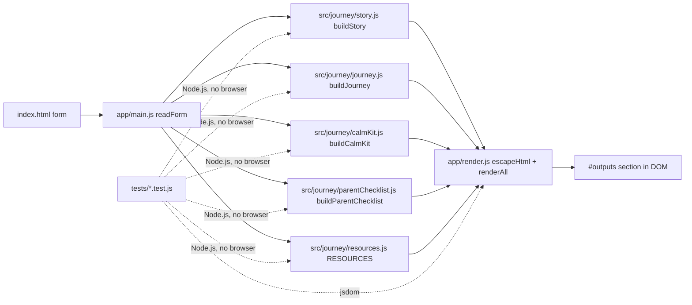

# Calm Skies Journey Builder

Built with [IBM Bob](https://www.ibm.com/products/ai-coding-agent) at the IBM Champions Bobathon NYC 2026 · Team Guild

**▶ Live demo:** https://marcelonyusa1.github.io/bobathon-nyc-2026-delivery/ ·
**🎥 Demo video:** https://github.com/MarceloNYUSA1/bobathon-nyc-2026-delivery/blob/main/deliverables/CalmSkies-TeamGuild-demo.mp4 ·
**📦 Submission package:** deliverables/Guild.zip ·
**✅ Tests:** 100/100 passing ·
**Engineering history:** https://github.com/MarceloNYUSA1/bobathon-nyc-2026

---

## For judges: 3-minute tour

1. Open the **live demo** (link above). Enter the demo scenario values: name = Sam, age = 8–10, first flight = yes, from = New York JFK, to = Orlando MCO, sensitivities = noise + crowds, communication = pictures, comfort item = blue blanket, visiting = Grandma, calm strategy = take slow breaths and squeeze my fidget, exciting detail = swimming in the pool. Click **Build My Journey**.
2. Watch the **demo video** (2:38) — screen capture of the same app with the same fictional data; narration by AI avatar (HeyGen, disclosed in Tools used).
3. Read the four evidence chains in the **How IBM Bob was used** section below.
4. Optional: `npm install && npm test` — 100 tests, 0 failures.

---

## Bobathon submission checklist

| Official requirement | Where to find it | Status |
|----------------------|------------------|--------|
| ONE ZIP named exactly as the registered team | `deliverables/Guild.zip` (team name: Guild) | ✅ |
| `bob_sessions/` — 14 IBM Bob sessions (Marcelo Lorenzetti's Bob tasks during the event), exported verbatim from Bob's local task database | `deliverables/Guild.zip → bob_sessions/` | ✅ |
| `code_files/` | `deliverables/Guild.zip → code_files/` | ✅ |
| `README.md` with Problem statement, Detailed solution, Assumptions / approach, How Bob was used | This file | ✅ |
| Demo video inside the ZIP | `Guild.zip → CalmSkies-TeamGuild-demo.mp4` (top level, 2:38) | ✅ |
| Feedback form completed by every registered member | Completed on the submission portal by each member | ⏳ pending confirmation |
| Upload to the Box folder | Upload via submission portal | ⏳ pending |
| Deadline: Wednesday 30 Sep 2026, 3:00 PM ET | Targeting submission by 12:00 PM ET | ⏳ |

---

## How we address the judging criteria

| Criterion (weight) | Evidence |
|--------------------|----------|
| **Innovation & Creativity (35)** | Problem: we did not find a free, privacy-safe, offline-capable preparation tool that adapts a flight narrative to a child's specific sensitivities. Solution: 5 personalized outputs from a single form click — not generic tips but a first-person story the child can read. IBM Bob as SDLC engine (not just autocomplete) across requirements → architecture → tests → accessibility → security → docs — that is the innovation. |
| **Impact & Practicality (35)** | Runs in any browser, no install, no account. Prints offline; works after page load without a connection. Sensitivities, communication preference, comfort item, calm strategy and exciting detail are directly actionable for caregivers. White-label adoption path documented (`docs/ARCHITECTURE.md`, `DEPLOYMENT.md`). No medical advice, no guarantees, no data stored. |
| **Technical Implementation (30)** | 100 unit + integration + accessibility + security tests (`npm test`). XSS protection on all user inputs via `escapeHtml()` (NF6). Path traversal decode-then-validate in `scripts/serve.js` (ae070d5). Automated axe-core scan + manual contrast/focus review (`docs/ACCESSIBILITY_REPORT.md`). Pure ES module architecture (no framework, no build step). Every Bob task links to requirement IDs and a passing test run (see How IBM Bob was used). |

---

## Problem statement

**Can IBM Bob turn a meaningful accessibility requirement into an accessible, tested, secure and maintainable customer experience through a disciplined SDLC?**

Air travel is one of the most stressful experiences for autistic children and their families. The airport environment is loud, unpredictable, crowded and full of transitions — exactly the conditions that are hardest to prepare for. We did not find a free, privacy-safe, offline-capable preparation tool that adapts the journey narrative to a child's specific sensitivities.

Calm Skies Journey Builder is a static web application that helps a caregiver prepare an autistic child for a flight. A caregiver enters a small amount of trip and preference information; the app instantly produces five personalized outputs:

1. **My Flight Story** — a first-person narrative adapted to the child's sensitivities
2. **My Airport Journey** — a 10-step visual sequence, keyboard-navigable
3. **My Calm Kit** — a packing checklist tailored to the child's needs
4. **Parent Checklist** — a before-departure and per-stage checklist
5. **Accessibility Resources** — sourced, labelled links to external organizations

No data leaves the browser. No account is required. The page prints offline.

The enterprise value is not just the tool — it is the engineering discipline IBM Bob applied to build it: requirements with testable acceptance criteria, a documented architecture, pure tested logic, XSS protection, an automated accessibility scan, a privacy and security review (BOB-017), and a deployment guide (BOB-018).

---

## Detailed solution

### Human use case

A caregiver (parent, teacher, therapist) visits the app on any device. They fill in up to thirteen optional fields: the child's name or nickname, age range, whether it is a first flight, departure and destination, sensitivities (noise, crowds, transitions, waiting), communication preference (spoken, pictures, written), one free-text concern, a comfort item to bring (e.g. "blue blanket"), who the child is visiting (e.g. "Grandma"), a calm strategy for worried moments (e.g. "take slow breaths and squeeze my fidget"), and one exciting thing about the trip (e.g. "swimming in the pool").

One click produces all five outputs on the same page. The caregiver can print or save as PDF — no internet connection needed after page load. Nothing is stored; closing the tab clears all data.

### Architecture



No network calls. No localStorage. `escapeHtml()` sanitizes every user-supplied value before `innerHTML` insertion.

### Enterprise story (adoption path — not yet built)

A travel provider — airline, airport, or accessibility-focused travel app — could adopt Calm Skies as a white-labelled preparation experience:

- **Hosting:** drop the static files on any CDN or object store; no server runtime required
- **Branding:** override CSS variables in `app/app.css`; no logic changes needed
- **Content extension:** journey steps, resources and kit items are pure data in `src/journey/`; a content team can update them without touching rendering or test code
- **Governance:** every content change requires a passing test suite (`npm test`) and produces a traceable commit
- **Compliance burden is low** because no personal data is stored, no authentication is needed, and no backend is involved

These are adoption ideas, not built features. No airline or airport is affiliated with this project.

### IBM Bob's SDLC role

Bob was the primary implementation tool across the full software development lifecycle:

| SDLC phase | What Bob did | Evidence |
|------------|--------------|----------|
| Requirements | Authored `docs/REQUIREMENTS.md` (37 IDs, testable criteria) | c487978 |
| Architecture | Authored `docs/ARCHITECTURE.md` (file layout, data-flow, alternatives rejected) | c487978 |
| Implementation | Wrote all application code: `index.html`, `app/`, `src/journey/`, `scripts/` | f61fd41–b5c0a07 |
| Testing | Wrote 100 unit, integration, accessibility and security tests | b5c0a07–663b689 |
| Accessibility review | Automated axe-core scan; 2 keyboard focus losses found in real-browser review outside Bob; Bob fixed both (BOB-010) | `tests/a11y.test.js`; 1286430 |
| Security review | XSS vector found in design review outside Bob; Bob fixed it — added `escapeHtml`, NF6 tests (f61fd41, ff7b557); dev server network exposure found in code review outside Bob; Bob fixed it — localhost-only, strict public-file allow-list (d5367cc); encoded path traversal found by a probe outside Bob; Bob fixed it — decode-then-validate, regression tests (ae070d5) | f61fd41, ff7b557, d5367cc, ae070d5 |
| Content review | 8 factual/wording defects found in review outside Bob; Bob fixed copy and added wording tests | b6799f2 |
| Personalization | A.J. Aronoff's requirements (comfort item + visiting + calm strategy + exciting detail) implemented by Bob (BOB-019, BOB-023) | d567321, 663b689 |
| Documentation | Authored architecture, requirements, plan, evidence log, accessibility report, responsible engineering review, deployment guide | c487978, d83a6be, 8bfc6a9 |

### Responsible engineering

- No medical advice, diagnosis or treatment recommendations
- No guarantees about airline, airport or TSA procedures (all wording uses "may" and "can")
- Only the minimum data needed for generation is collected (13 fields, all optional except name)
- All data stays in the browser session; no server storage, no accounts, no analytics
- External resources are labelled with their source and marked as external links

---

## Assumptions and approach

- **Stack:** pure static HTML + CSS + JavaScript ES modules; no framework, no build step, no backend
- **All journey logic is in pure functions** (`src/journey/`) testable in Node.js without a browser
- **XSS protection:** all user-supplied text goes through `escapeHtml()` before any `innerHTML` insertion; NF6 tests cover the `` payload
- **Accessibility:** axe-core/jsdom for structural rules; contrast and focus checked manually in a real browser; results in `docs/ACCESSIBILITY_REPORT.md`
- **Provenance:** the submitted codebase was built during the Bobathon. It was informed by the team's prior Calm Skies concept, research and lived experience; no pre-event application code was used.
- **Demo scenario:** "Sam", age 8–10, first flight JFK → MCO, sensitive to noise and crowds, communication preference: pictures, comfort item: "blue blanket", visiting: "Grandma", calm strategy: "take slow breaths and squeeze my fidget", exciting detail: "swimming in the pool"

---

## How IBM Bob was used

Every task below was implemented by IBM Bob (Agent mode). Commits link to the evidence.

| Task | Phase | What Bob did | Commit |
|------|-------|--------------|--------|
| BOB-001 | Requirements + Architecture + Plan | Authored REQUIREMENTS.md (37 req IDs), ARCHITECTURE.md, plan.md | c487978 |
| BOB-002 | Scaffold | index.html, app/app.css, app/main.js, app/render.js (escapeHtml), scripts/serve.js, package.json, a11y test | f61fd41 |
| BOB-002b | Security fix — path traversal | serve.js: decode-then-validate, 8 traversal regression tests | ae070d5 |
| BOB-002a | Security fix — network exposure | serve.js: localhost-only, strict allow-list | d5367cc |
| BOB-003 | Journey logic | buildStory() — 10 narrative steps, sensitivity-adapted | b5c0a07 |
| BOB-003a | Content fix | US English, no-guarantee wording, factual accuracy, wording tests (8 defects found outside Bob) | b6799f2, 2d4365b |
| BOB-003b | Wording test coverage | Wording test extended to cover all outputs | 2d4365b |
| BOB-004 | Journey logic | buildJourney() — 10 steps with label/description/tip/symbol, tests | 234dc60 |
| BOB-005 | Journey logic | buildCalmKit() — ≥8 items, disclaimer, tests | 73024d6 |
| BOB-006 | Journey logic | buildParentChecklist() — beforeHome/perStage/notes, tests | 73024d6 |
| BOB-007 | Journey logic | RESOURCES module — 6 entries, no fetch, lastChecked, tests | 697e430 |
| BOB-008 | Render layer | Full renderAll() wiring all 5 outputs; journey navigator | ff7b557 |
| BOB-009 | Integration | Demo-scenario smoke test; full suite tests green | ff7b557 |
| BOB-010 | Accessibility hardening | Fixed 2 focus-loss defects; ACCESSIBILITY_REPORT.md; focus management tests | 1286430 |
| BOB-001B | Docs reframe | Enterprise SDLC framing across README, REQUIREMENTS, ARCHITECTURE, plan | d83a6be |
| BOB-001C | Docs accuracy | Attribution and claims accuracy: test count, provenance, review credits | 381f792 |
| BOB-017 | Responsible engineering | Privacy & security review → docs/RESPONSIBLE_ENGINEERING.md | 8bfc6a9 |
| BOB-018 | Deployment guide | GitHub Pages steps → DEPLOYMENT.md | 8bfc6a9 |
| BOB-019 | Personalization (A.J.'s requirement) | Comfort item + visiting fields in form; story personalization; 8 new tests | d567321 |
| BOB-021 | Wording accuracy | Mislabeled duplicate resource link + US spelling; found outside Bob while rendering demo pages | eef5423 |
| BOB-021b | Docs accuracy | Test count and BOB-021 row | 8f396e1 |
| BOB-022 | Demo video disclosure | Demo video + HeyGen disclosure added to README | 78aff3b |
| BOB-023 | Social story elements (A.J.'s requirement) | calmStrategy + excitingDetail fields; 3 Calm Kit items (R16); "If it gets hard" checklist section (R17); 17 new tests (100 total) | 663b689 |
| BOB-023b | Docs accuracy | README count and BOB-023 commit refs | eceff82 |
| BOB-FINAL | Docs sync | Final sync of all docs to HEAD; US English fix; wording test extended to index.html | 0fe77c7 |
| BOB-FINAL-b | Docs accuracy | Corrected test counts, US spelling throughout, broken doc paths | 71fb097 |
| BOB-025 | Final README for judges | Requirement ID fix (R14–R17); README restructured for judges; evidence accuracy fixes | HEAD |

### Four strongest evidence chains

**1 · Journey Builder P0 build**
Requirements R10–R13 (Flight Story: ≥9 steps, sensitivity adapts, name in first para, first-flight reassurance) → Bob task BOB-003 → commit b5c0a07 → `node --test tests/story.test.js` → 8 pass, 0 fail. Full demo path (all 5 outputs) confirmed in BOB-009 → commit ff7b557 → `npm test` → 43 pass at that point.

**2 · Content accuracy remediation + wording test**
8 factual/wording defects (shoe-removal instruction, guarantee language, British spellings, inaccurate exit sign claim) found in review outside Bob → Bob task BOB-003a → commit b6799f2 → `npm test` → wording tests green. Regression prevented by 13 wording tests in `tests/wording.test.js`.

**3 · Path traversal: found outside Bob → Bob fix → regression tests**
Encoded path traversal (20 payloads including `%2e%2e%2f`, `%252e%252e%252f`, `%5c`) found by a probe outside Bob → Bob task BOB-002b → commit ae070d5 (`decode-then-validate` in `scripts/serve.js`) → `npm test` → 18 serve tests pass, including 8 traversal regression cases.

**4 · A.J.'s personalization requirements (BOB-019, BOB-023)**
A.J. Aronoff (team) supplied R8 (comfort item), R9 (visiting), R14 (calm strategy), R15 (exciting detail), R16 (Calm Kit items), R17 ("If it gets hard") → Bob tasks BOB-019 + BOB-023 → commits d567321, 663b689 → `npm test` → 100 pass, 0 fail at commit 663b689. Story personalization, kit label personalization, and XSS protection for all new fields verified.

---

## What's in this repository

```
index.html            Static app entry point
app/                  app.css, main.js, render.js (escapeHtml + renderAll)
src/journey/          Pure ES module functions: story, journey, calmKit, parentChecklist, resources
tests/                100 tests: story, journey, calmKit, parentChecklist, resources, integration, a11y, serve, wording
docs/                 REQUIREMENTS.md, ARCHITECTURE.md, plan.md, ACCESSIBILITY_REPORT.md,
                      RESPONSIBLE_ENGINEERING.md, DEPLOYMENT.md, demo-script.md
evidence/             BOBATHON_EVIDENCE.md — requirement → Bob activity → files → test → commit
deliverables/         Guild.zip (submission package), demo video, bob_sessions/
```

Instructions to Bob are archived in the engineering repository (https://github.com/MarceloNYUSA1/bobathon-nyc-2026).

---

## Responsible engineering

- No medical advice, diagnosis or treatment recommendations in any generated text
- No guarantees about airline, airport or TSA procedures
- Only the minimum data needed for generation is collected; no email, location or biometric data
- All data stays in the browser session; closing the tab clears everything
- External resources are clearly labelled with their source organization name and marked as external links

---

## Tools used

- **IBM Bob** wrote all application code, tests, and the documentation files it committed
- **Claude Code (Anthropic)** acted as a planning coach and reviewer; produced `STATUS.html` and internal dashboard records (not included in submission); instructions to Bob are archived in the engineering repository
- **ChatGPT (OpenAI)** was used pre-event for strategy, option analysis and competition-readiness review
- **Human contribution:** Marcelo chose the problem and framing and accepted trade-offs; the architecture was proposed by Bob and reviewed outside Bob
- **Libraries (devDependencies only):** axe-core 4.9, jsdom 24 — used for automated accessibility testing; not in the production bundle
- **HeyGen** — the demo video's narration uses an AI avatar; all app footage is real screen capture of this repository's application with fictional demo data

---

## Run it

```
npm install     # installs axe-core + jsdom (dev only)
npm start       # http://127.0.0.1:8080 (localhost only)
npm test        # node --test tests/*.test.js  →  100 tests, 0 failures
```

---

## Demo video

`CalmSkies-TeamGuild-demo.mp4` (2:38) is included in the submission package. Scenario: a fictional 8-year-old "Sam", first flight New York JFK → Orlando MCO.

---

## Team

Team Guild. Marcelo Lorenzetti: project lead (problem choice, framing, scope and trade-off decisions, acceptance, demo). A.J. Aronoff: Calm Skies concept and product requirements (social stories, two voices — one for the caregiver, one for the child — go-bag and travel-resource research), from which requirements R8/R9/R14–R17 and the content direction came.

## License

MIT
